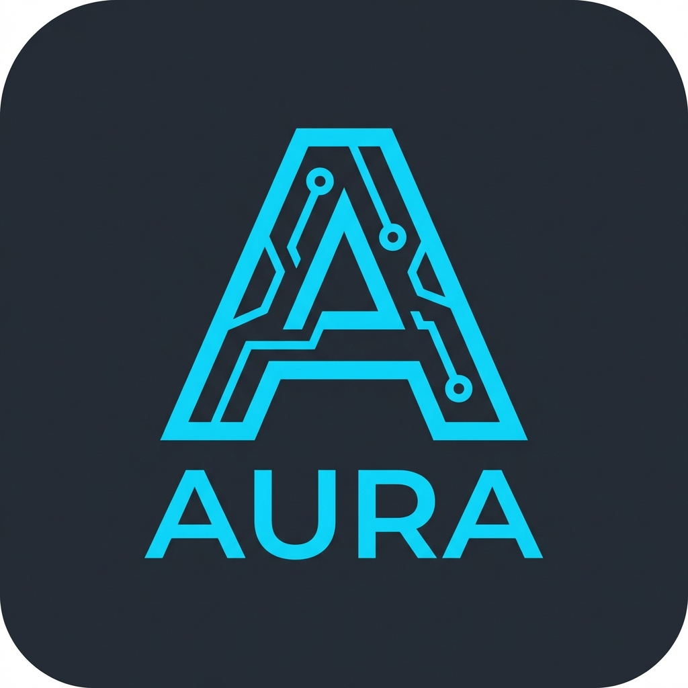
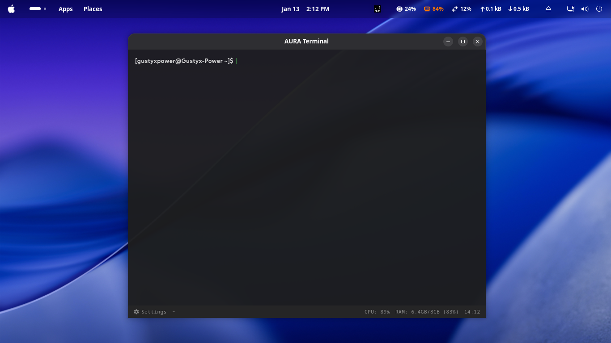
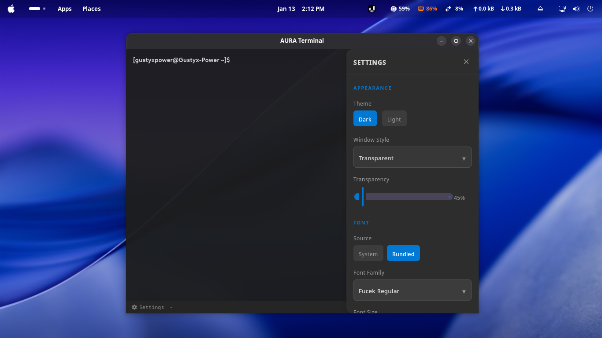
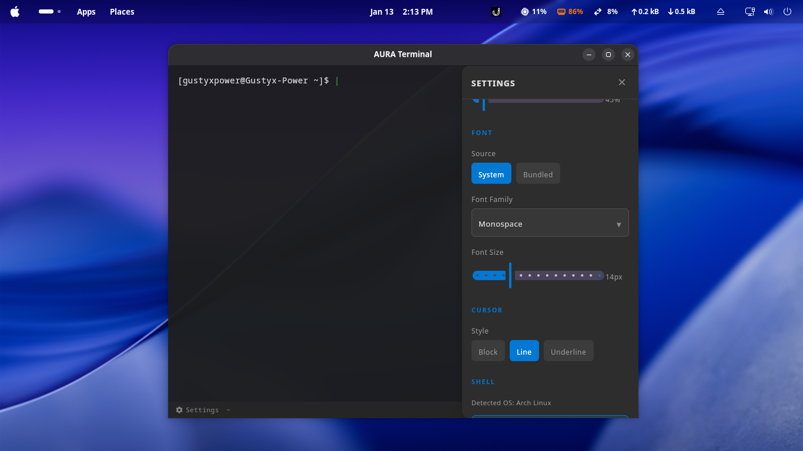
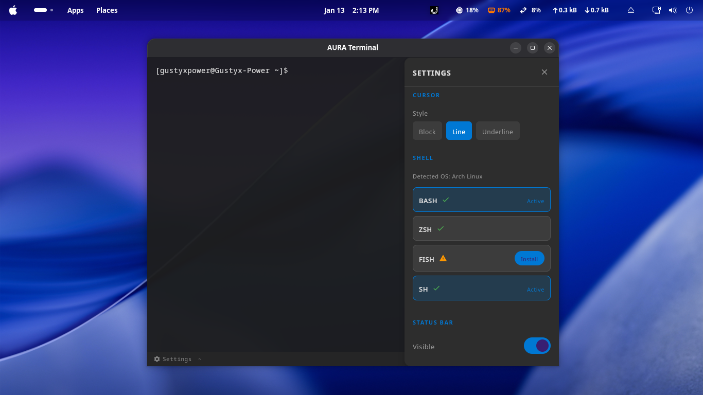
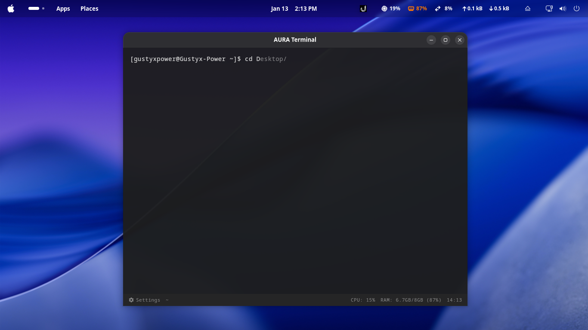

# AURA-Terminal
> A Modern Terminal For User




AURA-Terminal is a modern, cross-platform terminal emulator built with Kotlin Multiplatform and JetBrains Compose. It features a sleek, transparent UI, extensive customization options, and a focus on user experience.

## ✨ Features

- **Modern UI**: Clean, transparent, and aesthetically pleasing interface.
- **Cross-Platform**: Runs on Linux, macOS, and Windows.
- **Customizable**: extensive settings for appearance and behavior.


### Gallery
| | |
|:---:|:---:|
| <br>_Smart Suggestions_ | <br>_Command Palette_ |
| <br>_Settings UI_ | <br>_Appearance Settings_ |
| <br>_Profile Management_ | |

## 📥 Installation

### Arch Linux (AUR)
You can install AURA-Terminal directly from the AUR:
```bash
yay -S aura-terminal-bin
```

### Windows, macOS, Debian/Ubuntu, Fedora/RHEL
Download the installer for your platform from the **[Releases Page](https://github.com/Gustyx-Power/AURA-Terminal/releases/latest)**.

| Platform | Installer Type |
|----------|---------------|
| **Windows** | `.msi` |
| **macOS** | `.dmg` |
| **Ubuntu / Debian** | `.deb` |
| **Fedora / RHEL** | `.rpm` |

## 🛠️ Development

### Prerequisites
- JDK 17 or higher
- Kotlin 2.1.0+
- Rust

### Building from Source

1. **Clone the repository:**
   ```bash
   git clone https://github.com/Gustyx-Power/AURA-Terminal.git
   cd AURA-Terminal
   ```

2. **Run the application:**
   ```bash
   ./gradlew run
   ```

3. **Build Installers:**
   ```bash
   # Linux (Deb/Rpm)
   ./gradlew packageDeb packageRpm

   # Windows
   ./gradlew packageMsi

   # macOS
   ./gradlew packageDmg
   ```

## 📄 License
Gnu General Public License v3.0
Copyright © 2026 Xtra Manager Software. All rights reserved.
